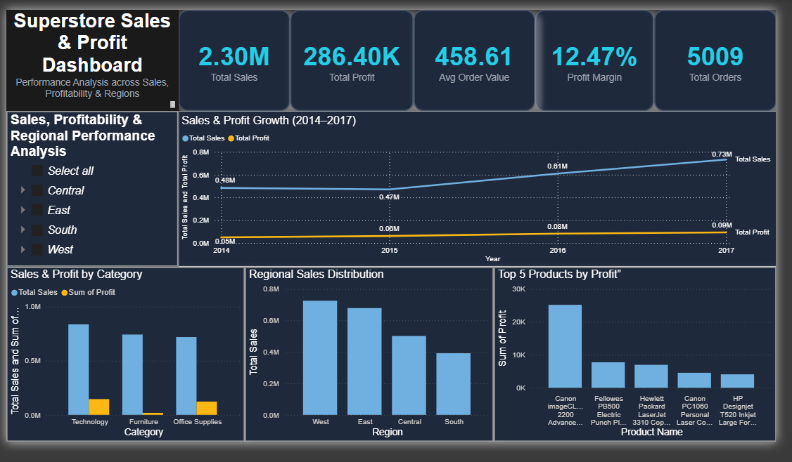

# 📊 Superstore Sales & Profit Analysis Dashboard


---

## 🚀 Project Overview

In today’s data-driven business environment, organizations generate large volumes of transactional data but often struggle to extract meaningful insights.

This project is an **interactive Business Intelligence dashboard** built using **Power BI**, designed to analyze and visualize sales and profit performance using the **Superstore dataset**.

The dashboard transforms raw data into actionable insights, helping businesses understand:
- Sales trends over time  
- Profitability across regions and categories  
- High-performing products  
- Overall business performance  

---

## 📸 Dashboard Preview



*Figure: Comprehensive Superstore Sales & Profit Dashboard displaying KPI metrics, growth trends, regional performance, and category-wise insights.*

---

## 📊 Key Features & Insights

### 🔹 KPI Overview
- Total Sales: **2.30M**
- Total Profit: **286.40K**
- Average Order Value: **458.61**
- Profit Margin: **12.47%**
- Total Orders: **5009**

---

### 📈 Sales & Profit Trends
- Year-wise analysis from **2014 to 2017**
- Identifies growth patterns and business expansion trends

---

### 🌍 Regional Analysis
- Sales distribution across:
  - West
  - East
  - Central
  - South

👉 Helps identify high-performing and underperforming regions

---

### 📦 Category Analysis
- Comparison of:
  - Technology
  - Furniture
  - Office Supplies

👉 Reveals profitability differences across categories

---

### 🏆 Top Products
- Highlights **Top 5 products by profit**

👉 Helps in strategic decision-making and inventory optimization

---

### 🎛️ Interactive Filters
- Region-based filtering for dynamic insights
- Enables drill-down analysis

---

## 📁 Repository Structure

```

├── project_report.pdf               # Detailed project report
├── Supermarket_sales_dashboard.pbix # Power BI dashboard file
├── dataset.csv                      # Superstore dataset
└── README.md                        # Project documentation

````

---

## 🛠️ Tech Stack

### 🔹 Data Source
- Pre-cleaned Superstore dataset

### 🔹 Visualization Tool
- Power BI for dashboard development

### 🔹 Data Modeling
- Structured relationships between:
  - Year
  - Region
  - Category
  - Product

### 🔹 DAX Calculations
Custom measures created for:
- Profit Margin  
- Revenue Growth %  
- Total Sales & Profit  

---

## 📌 Key Insights

- 📈 Sales increased steadily from **2014 to 2017**
- 💰 Profit growth is slower than sales → indicates margin improvement opportunity
- 🌍 West region performs best; South region needs improvement
- 📦 Technology category generates highest revenue
- 🏆 Few products contribute major share of profit

---

## ⚡ Unique Points

- Interactive and user-friendly dashboard  
- Business-focused KPI analysis  
- Clean and professional UI design  
- Real-time filtering and drill-down capabilities  

---

## 🔮 Future Improvements

- Add **predictive analytics** for forecasting sales  
- Integrate **real-time data sources (APIs)**  
- Include **customer segmentation analysis**  

---

## ▶️ How to Use

1. Clone the repository:
```bash
git clone https://github.com/maskedgojo/Sales_-_Profit_Dashboard.git
````

2. Open the dashboard:

* Install **Power BI Desktop**
* Open the `.pbix` file

3. Interact with the dashboard:

* Use filters to explore data by region and category

---

## 👨‍💻 Author

**Kushaagra Singh**
B.Tech CSE

---
